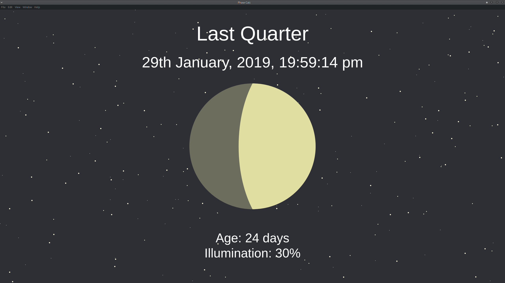

Moon View
=========

[Electron](https://electronjs.org/) app which shows the current phase of the moon (and possibly even more to come...)

### Screenshot

### Description/Purpose

The real purpose of this app is to get some practice in with Electron (and therefore NodeJS).

The original plan was to calculate the phase information myself (hence the original title of this project of `phaseCalc`) but as [lune](https://www.npmjs.com/package/lune) exists, this seemed a little pointless.

Animations for the moon graphics were done with [PaperJS](http://paperjs.org/tutorials/).

### Usage

As this project is not complete and therefore not packaged, runnning the app goes as follows:

    npm i
    npm start # Equivalent to `electron .`

#### Dependencies

- [NodeJS](https://nodejs.org/en/) (`node` and `npm`)
- [Electron](https://electronjs.org/) (currently using v3.0.11)
